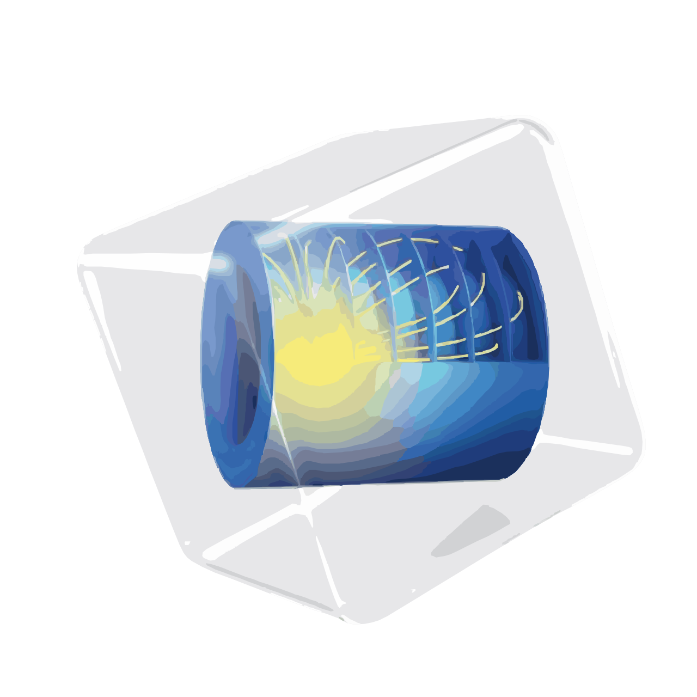

# Hi, you've arrived at Sina's GitHub!  I'm not in right now; please leave a [message](mailto:mohammadsina.ghanbaripakdehi@mail.polimi.it).

## :raising_hand: About me:
I'm a <b>Master's student</b> of <b>Chemical Engineering</b> at <a href="https://www.polimi.it/en/"><b>Politecnico di Milano</b></a>. 
◽ Intrested in <b>research</b>, <b>simulation</b>, and <b>numerical methods</b> in chemical engineering. 
◽ I’m currently learning Computational Fluid Dynamics in Reacting Flows! 
◽ Playing Chess, Listening to Rock and Jazz Music, and Playing Guitar are my common hobbies!<be>

 
  

## 💻 Things I know
> <i>Tools, languages, and other things that I like to work with.</i>
 
<table>
  <tr>
    <td align="center" width="96">
      
       Python
    </td>
    <td align="center" width="96">
      
       MATLAB
    </td>
    <td align="center" width="96">
      
       COMSOL
    </td>
    <td align="center" width="96">
      
       Git
    </td>
    <td align="center" width="96">
      
       R
    </td> 
  </tr>
</table>
 

##
 

<i>In case you wanna reach out to me</i>

 

  &nbsp;&nbsp;&nbsp;
  

 

